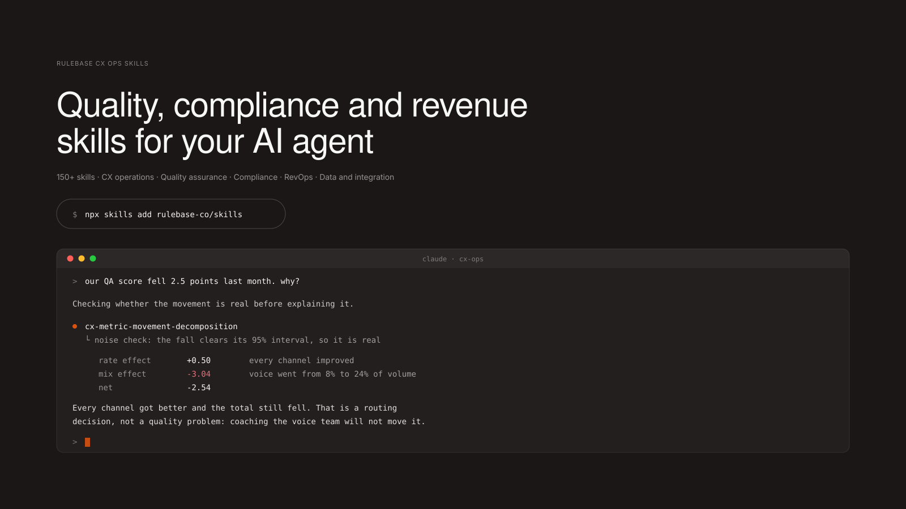

<div align="center">



# Rulebase Skills

**Supercharge your AI agent for customer support operations.** 150 skills across QA and
calibration, complaints and conduct, churn and expansion signal, forecasting, coaching,
and the data contract underneath it all.

Works with [Claude Code](https://claude.com/claude-code) &middot; [Codex](https://openai.com/codex) &middot; [Cursor](https://cursor.com) &middot; anything that reads [`SKILL.md`](https://skills.sh)

[](https://www.npmjs.com/package/rulebase-skills)
[](https://github.com/rulebase-co/rulebase-skills/actions/workflows/validate.yml)
[](CATALOG.md)
[](LICENSE)

</div>

---

## Contents

- [Quick start](#quick-start)
- [Commands](#commands)
- [Skills catalog](#skills-catalog)
- [Try it](#try-it)
- [What makes these different](#what-makes-these-different)
- [Contributing](#contributing)
- [The standard](#the-standard)

---

## Quick start

```bash
npx rulebase-skills install --category quality-assurance
```

Or hand the whole thing to your agent — **paste this into Claude Code, Cursor or Codex**:

```
Install the Rulebase CX ops skills:

In the terminal, run `npx rulebase-skills list` to see what's available, then
`npx rulebase-skills install --category quality-assurance` to install a category
(or --all for everything).

Then tell me what you can now help me with.
```

Skills land in `~/.claude/skills/` by default. Other targets:

| Flag | Destination |
| --- | --- |
| `--claude` | `~/.claude/skills/` (default) |
| `--codex` | `~/.codex/skills/` |
| `--cursor` | `<project>/.cursor/skills/` |
| `--project-dir <path>` | that project instead of your home directory |
| `--dir <path>` | straight into a directory, whatever the tool expects |

`--dir` is the escape hatch: agent tools move their skill directories between versions,
so nothing here depends on us guessing right.

<details>
<summary>Other ways in</summary>

The [Vercel <code>skills</code> CLI](https://github.com/vercel-labs/skills) also works:

```bash
npx skills add rulebase-co/rulebase-skills
npx skills add rulebase-co/rulebase-skills --skill cx-deflection-analysis
```

Or copy any skill directory into `~/.claude/skills/` by hand. A skill is a directory with
a `SKILL.md` in it; there is nothing else to it.

</details>

---

## Commands

```bash
npx rulebase-skills list                       # everything, grouped by category
npx rulebase-skills list --category revops     # one category
npx rulebase-skills search "revenue at risk"   # search names and descriptions
npx rulebase-skills info cx-churn-signal       # what it does, and what's in it
npx rulebase-skills install cx-churn-signal    # one skill
npx rulebase-skills install --category compliance
npx rulebase-skills install --all
```

---

## Skills catalog

**150 skills in six categories**: 62 CX operations, 32 compliance, 27 quality assurance,
14 RevOps, 10 data and integration, 5 Rulebase.

**[CATALOG.md](CATALOG.md)** describes every one. Or browse from the terminal, which reads
the same generated index the installer uses:

```bash
npx rulebase-skills list
```

Vendor-neutral by design: there are no per-helpdesk exporters, because vendor APIs date
faster than anything else here and a stale exporter is worse than none. Land your
conversation data in [one canonical shape](skills/data-and-integration/cx-conversation-schema)
and every analysis runs against it.

---

## Try it

Once installed, just ask. These are the phrasings the skills are written to fire on:

```
"Why did our QA score drop last month?"
"What would our SLA attainment be if the P1 target were two hours?"
"Are we meeting our complaint deadlines?"
"Which customers look like they're about to leave?"
"Prepare a coaching pack for Ana's 1:1 on Thursday."
"Is our AI grading too harshly, or is the criterion ambiguous?"
"Did we actually tell customers they were talking to a bot?"
"Our weekly report keeps changing definitions — turn it into something comparable."
```

Your agent loads the matching skill and follows it. If nothing fires, the description is
wrong, and that's a bug worth
[reporting](https://github.com/rulebase-co/rulebase-skills/issues).

---

## What makes these different

**They lead with what breaks.** The first paragraph of each skill is the thing that goes
wrong: the containment rate that counts abandonment as a success, the QA score that's ±29
points of noise, the SLA attainment that looks good because the slow tickets are still
open.

**The numbers are checked.** Confidence intervals are computed, not asserted. No invented
industry benchmarks and no regulatory deadline stated from memory — where a figure is
plan- or jurisdiction-dependent, the skill says so rather than guessing.

**They report what they can't conclude.** Analyses name the conclusions your data doesn't
support, and several refuse to run when the input would only reproduce the number you're
trying to audit.

**Customer data is treated as production PII.** Credentials from the environment only,
read-only by default, and the agent is told not to echo transcripts into chat.

**Writes are separated from decisions.** Anything that changes a live system consumes a
reviewed plan file, so an agent can propose a bulk change without being able to perform
one. CI rejects a mutation skill missing a dry-run default, an audit log, a resume
journal, a bounded blast radius, or a stated reversibility.

**The scripts are tested against the failure paths** — business-day and month-end
deadline arithmetic, right-censored SLA attainment, the kappa paradox, checkpoint and
resume, malformed input, and Erlang C verified against an independent implementation.
213 tests, zero npm dependencies, stock Node 20+.

---

## Contributing

Read [AGENTS.md](AGENTS.md) — it's the authoring standard, and CI enforces most of it.
[CONTRIBUTING.md](CONTRIBUTING.md) covers the workflow.

```bash
npm run check        # strict validation, index freshness, and the tests
npm run build:index  # after adding or removing a skill; CI fails on a stale index
```

---

## The standard

Skills follow the [agent skills standard](https://github.com/vercel-labs/skills): a
directory with a `SKILL.md` containing YAML frontmatter, plus optional `references/` for
on-demand detail and `scripts/` for executables. Only the name and description load at
startup; the body loads when the agent decides the skill is relevant — which is why the
description is written as the whole product surface.

---

<div align="center">

[MIT](LICENSE) &middot; built by [Rulebase](https://rulebase.co)

</div>
